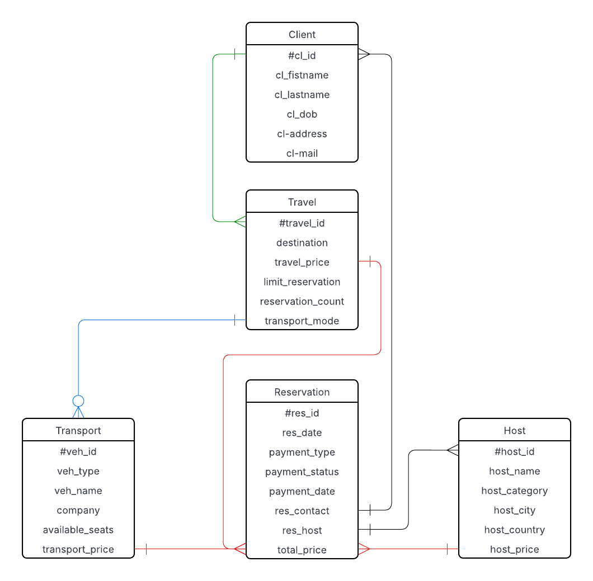
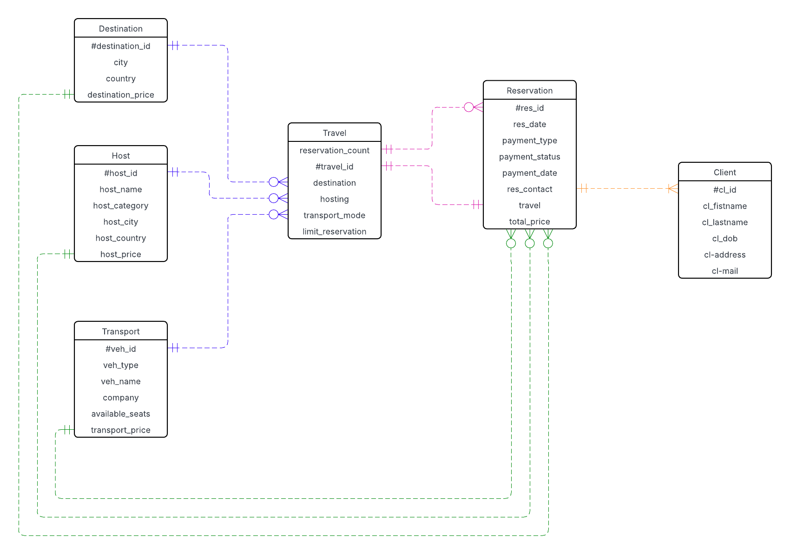
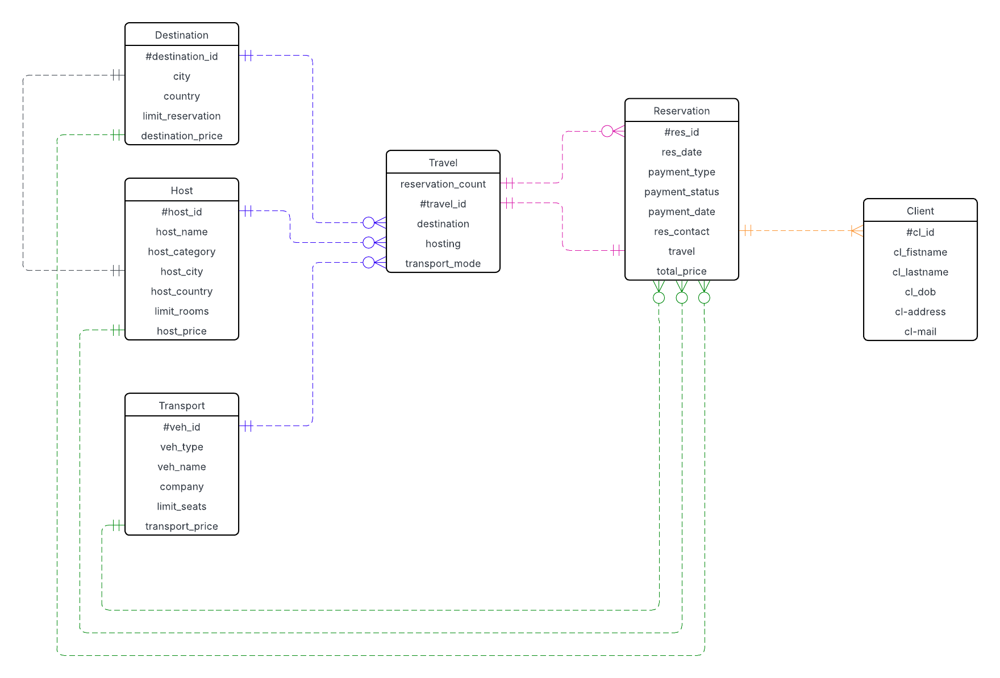
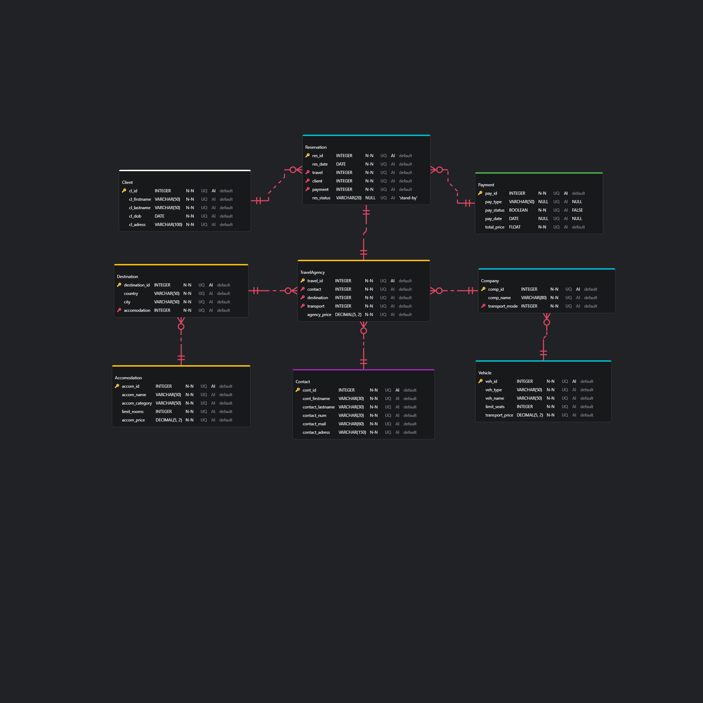

# 1.TRAIL-2.The-Hill-11.Modelisation_BDD

## Author
- Stéphan Martin

## Description
- PNG file of the diagram created for exercises of Modelisation_BDD

## Diagram 1st try

## Diagram 2nd try

## Diagram 3th try

## ERD Editor

## Commentaire
- Le MCD est différent du MPD car je me suis rendu compte des redondances lors de la retranscription lucidapp vers vscode (ERD Editor)
- Aussi base.sql contient des differences avec le MPD car l'extention ne permet pas les DELETE CASCADE, et ENUM()
- Des modifications ont eu lieu récemment dans la syntaxe (si j'ai le temps a mes heures perdues je reverrais tout les fichiers pour que ce soit lisible et cohérent en attendant tout fonctionne ^^)